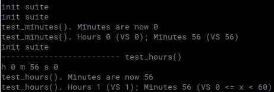
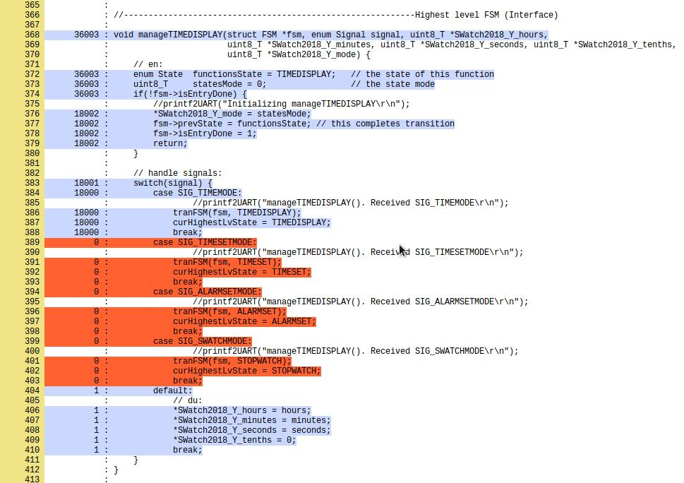

# Using Gcov
Gcov is an opensource SW for testing SW. Here are 2 results. The first one shows Gcov tests results (are they the expected ones?) and the second one shows the line coverage computed by Lcov.

(made with Ubuntu 18.04, GCC 64bit 7.3.0)

## Launching Gcov

to start gcov test, untar and give

	sudo apt-get install libcunit1 libcunit1-doc libcunit1-dev
	cd ~/workspace/di_natale/code_c/swatch4
	gcc tests.c SWatch2018.c  -o tests -Wall -I../CUnit-2.0-1/CUnit/Headers/ -lcunit && ./tests

The test returns 2 lines on terminal. You don't need any specific infrastructure like Matlab or Eclipse.

## Using Lcov (Gcov -> HTML)

The following is to start Gcov, the software that analyses how many times each line has been executed and the parts of the SW that have been executed and the ones that have not. This is useful to deepen tests and to optimize only the most used parts of the Sw, which are typically only 20% of the total:

	sudo apt install lcov
	cd ~/workspace/di_natale/code_c/swatch4_coverage_gcov/swatch4
	gcc tests.c SWatch2018.c  -o tests -Wall -fprofile-arcs -ftest-coverage -I../CUnit-2.0-1/CUnit/Headers/ -lcunit && ./tests
	gcov ./tests.c
	cat tests.c.gcov
	mkdir html
	lcov --capture --directory . --output-file html/coverage.info
		"directory" means that the analysis will be done on each gcov file in the current directory (.)
	cd html
	genhtml coverage.info
	
now open index.html with a browser

The limitation of Gcov is that it only works on standard C code and that the compiler must not optimize the code, because an optimization could join 2 lines together or delete one of them, making it impossible to show how many time each row has been executed.