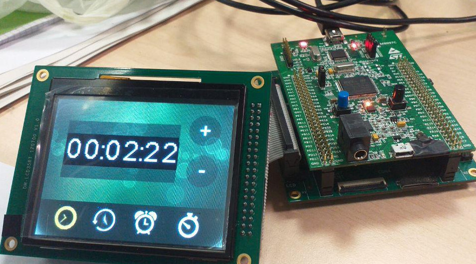
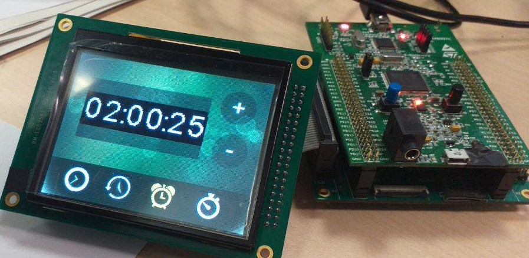

# Contents
This experiment shows how to turn an FSM, shown in folder "screenshots", into C code using the Nested Switches pattern. Note: the C code of the FSM has been generated by Matlab2018. Here are some results of a run:

<a href="../FSM/video_FSM_Matlab2019.mp4">Video FSM Matlab 2019</a>

# How to use
Open the project with Eclipse for ErikaOS 2.8, found at http://www.erika-enterprise.com/index.php/download/erika-v2.x.html . Import this project. Menu -> Project -> Clean... -> Build it after cleaning.

	cd University/DesignOfEmbeddedSystems/swatch4 test 150%/swatch4
	st-flash write Debug/c_mX.bin 0x8000000

st-flash must be downloaded from https://github.com/texane/stlink and installed manually. Windows users can also use the utility provided by ST, but you have to register on their website.
