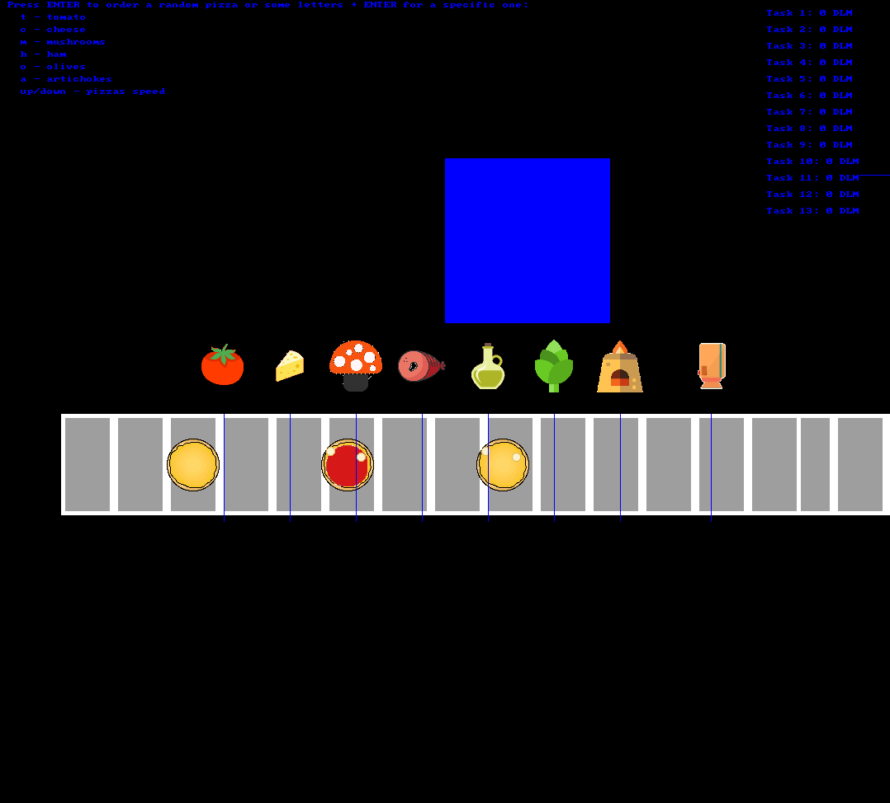

## Screenshots

You can create different instances of the same string. They run with different priorities (SCHED_RR). The highest priority strings respond in a better way.

In particular, each string is managed by a task (implemeneted as extension of pthread). Each task must simply write a string on the screen printing one characted every period. Since harmonic periods are used (in particular, one twice the previous one), when the i-th string has been totally printed, the half of the i-th + 1 has been written.

## Lesson learned

How to use Linux SCHED_RR to manage strings that must be shown with different priorities. It's important how the task is suspended until the next period.

## Dependencies
sudo apt install liballegro4-dev
Linux 4.15

## How to use it

make clean && make && make run